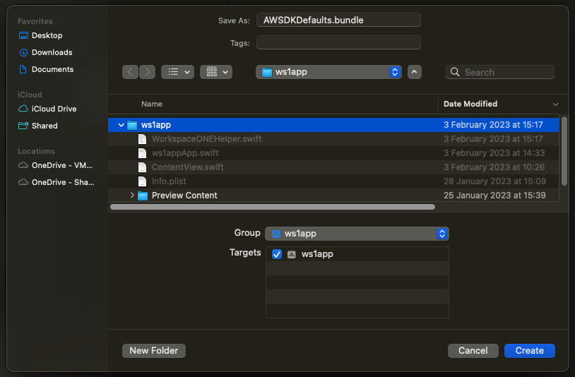
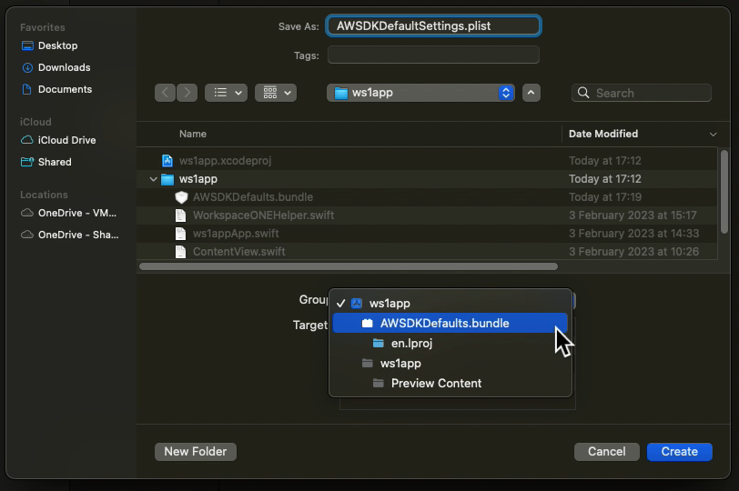

Declaring supported features is a Workspace ONE platform integration task for
mobile application developers. This task is dependent on the
[Task: Initialize the software development kit runtime](../04Task_Initialize-the-software-development-kit-runtime/readme.md).
The following instructions assume that the dependent task is complete already.

Declare the Workspace ONE features that your app supports by creating a resource
bundle and property list. Proceed as follows.

1.  Open your app project in Xcode.

2.  Create a Settings Bundle named `AWSDKDefaults.bundle`.

    (In this guide, the bundle will be created in the application resources. The
    bundle can instead be in a sub-group or in a package that has been added to
    the application.)

    One way to create the bundle is as follows.

    1.  In the Xcode navigator select the project itself.
    
        By default, the project itself will be the first item in the navigator.

    2.  In the Xcode menu, select File, New, File...

        This opens a template selection interaction.
    
    3.  Select the template: Settings Bundle.

        The template can appear in the Resource category. You can also search
        for it by filtering, for example for "bundle".
        
        Select the plain Settings Bundle template, not the WatchKit Settings
        Bundle template.
    
    4.  Click Next. A file save dialog will open.

    5.  Enter the name `AWSDKDefaults.bundle` and select to save in the top
        group of the project.

        This screen capture shows how the save dialog might look.
    
        
    
    The new bundle will be added to the resources that are copied into the app.
    You can check this in the target build phases, in the Copy Bundle Resources
    list. If it doesn't appear there, add it now by clicking the plus.

    This screen capture shows the bundle in the Xcode user interface.

    

3.  Create a property list named `AWSDKDefaultSettings.plist` in the bundle.

    One way to do this is as follows.

    1.  In the Xcode navigator select the project itself.
    
        By default, the project itself will be the first item in the navigator.

    2.  In the Xcode menu, select File, New, File...

        This opens a template selection interaction.
    
    3.  Select the template: Property List.

        The template can appear in the Resource category. You can also search
        for it by filtering, for example for "property".
    
    4.  Click Next. A file save dialog will open.

    5.  Enter the name `AWSDKDefaultSettings.plist` and select to save in the
        `AWSDKDefaults.bundle` group.

        This screen capture shows how the save dialog might look.
    
        

    The new property list file will be added to the bundle.

    If you save the property list somewhere else by mistake, you can drag and 
    drop it into the bundle to fix it.

4.  Add a first key to the property list, to declare support for the Workspace
    ONE secure pasteboard.

    1.  Open the AWSDKDefaultSettings.plist file as a property list.
    2.  Add to the Root Dictionary a new row as follows.

    Key               |Type   |Value
    ------------------|-------|-----
    AWClipboardEnabled|Boolean|YES

    This screen capture shows how the property list might look after adding the
    first key.

    

That completes the initial declaration of supported features. Build and run the
application to confirm that no mistakes have been made. You are now ready to
continue with the [Task: Demonstrate Basic Features](../06Task_Demonstrate-Basic-Features/readme.md).

# License
Copyright 2023 VMware, Inc. All rights reserved.  
The Workspace ONE Software Development Kit integration samples are licensed
under a two-clause BSD license.  
SPDX-License-Identifier: BSD-2-Clause